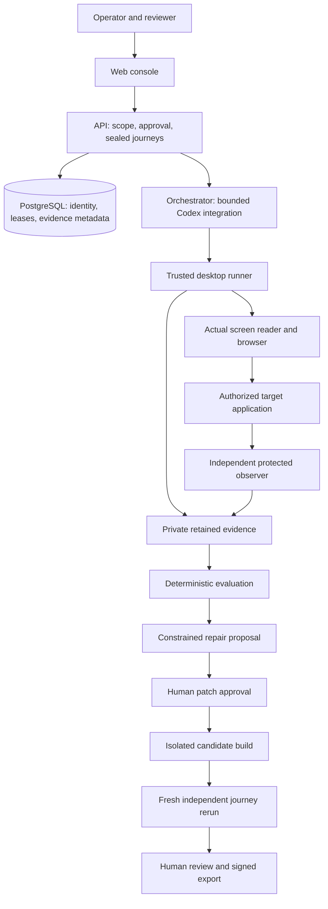

# AccessForge

**Status: implemented components; actual-reader end-to-end acceptance remains incomplete.**

**Product direction (2026-09-16): Codex, not AWS/Bedrock.** The owner retired the AWS-specific
product target. Diagnosis, repair and the navigator use local Codex with ChatGPT OAuth; the
Codex consent/runtime, retention/finalizer and consent UI changes are merged. Native host
integration and actual-reader acceptance remain incomplete. Historical AWS specifications and evidence remain
historical, not deployment instructions. See [migration status](docs/handoffs/codex-migration.md).

The API, web console, runner infrastructure, navigation/diagnosis/repair components,
sandboxed candidate builds, review and evidence export are implemented. Neither green CI nor
the reference application proves a successful actual VoiceOver repair journey. VoiceOver
qualification remains blocked; NVDA is contract-only. No production-readiness or accessibility
acceptance claim is made.

AccessForge is intended to help engineers reproduce a web accessibility barrier with a real
screen reader, prepare a constrained source repair, independently rerun the journey, and
review or export exactly what was established. It is not an accessibility overlay, a generic
chatbot, or a legal-compliance certificate.

## What is actually here right now

| Path | Contents |
|---|---|
| `specs/accessforge/` | The complete product specification package (PRD, TDD, CONTRACTS, TEST-PLAN, UI-UX, SECURITY-PRIVACY, RELEASE-CHECKLIST, SOURCES, and 30 numbered build prompts). Specification only. |
| `docs/` | Implementation-owned records produced as modules land: capability evidence, ADRs, module handoffs, and the delivery plan. |
| `apps/` | API control plane, web console, trusted desktop runner, model orchestrator and isolated build worker. |
| `fixtures/reference-app/` | A genuinely working local service-request application with PostgreSQL persistence, used as the authorized target under test. |
| `tests/` | Unit and integration suites. Integration runs against a real PostgreSQL server and fails rather than skips when one is absent. |
| `packages/` | Domain, contracts, persistence, evidence, clients and assistive-technology adapters. |
| `infra/` | Infrastructure configuration/proposals; presence does not imply deployment. |

Nothing in `specs/` asserts that code, tests, integrations, or releases exist. Claims about
this repository's actual state require current source and acceptance evidence. Historical module
handoffs describe their own checkpoints, not necessarily the latest aggregate status.

## Architecture



This diagram shows the intended connected workflow, not proof of physical acceptance.
The navigator cannot approve its own patch or author its own verdict.

## Baseline operator boundary

The trusted host can call `accessforge_orchestrator.baseline_completion.dispatch_and_complete`
to compose protected runtime provisioning, original reader admission/dispatch, acknowledged
STOP, runtime closure, retention and finalization. A qualified transport and original private
journal are required; the default transport refuses before runtime provisioning. There is no
automatic retry after an uncertain response. See [operator guidance](docs/handoffs/baseline-operator-completion.md).

The GitHub integration includes bindings, webhook receipts, publication intent/recovery and
outbound delivery code. Actual authenticated GitHub App delivery remains unverified.
Production identity, deployment, real NVDA,
actual-reader benchmarks and pilot acceptance remain open.

## Release scope vocabulary

- **E0** — one authorized application, one pinned macOS/browser/actual VoiceOver profile, one
  form-error recovery journey, with real navigation, an actual patch, an independent rerun,
  and human review.
- **R1** — the complete web product, adding actual Windows/NVDA support and production operations.
- **R2+** — mobile, PDF remediation, native desktop apps, managed multi-tenant desktop fleets.
  Out of scope here.

## Getting started

See [docs/development/VERIFICATION.md](docs/development/VERIFICATION.md) for install, database
setup, the full verification ladder, and how to run and inspect the services.

Requires Python 3.13, uv, Node 22, pnpm 11.10.0 and PostgreSQL 17. Use dedicated databases;
never point reset/test commands at a shared or production database. Service startup does not
start or qualify a screen reader.

```bash
uv sync --frozen
pnpm install --frozen-lockfile
pnpm build
pnpm typecheck
uv run pytest tests/unit/test_baseline_completion.py tests/unit/test_baseline_reader_dispatch.py -q
```

The focused checks prove composition, not actual-reader acceptance. See
[submission readiness](docs/delivery/SUBMISSION-READINESS.md) for remaining release work.

## Build workflow

Execution follows `specs/accessforge/MASTER-BUILD-AND-MERGE.md`: numbered modules in dependency
order, each delivered as its own reviewed pull request with evidence, merged into `main`, and
verified afterward. Module 00 (capability gate) runs first and establishes which real boundaries
are available before anything is promised.
