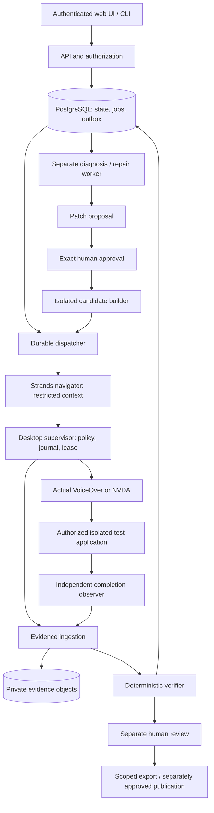

# AccessForge — Technical Design Document

Version 1.0 · 9 September 2026 · Proposed architecture. No repository implementation, platform capability, deployment or passing test is asserted by this document.

TDD here means **Technical Design Document**. Red/green/refactor execution and named test scenarios are in [TEST-PLAN.md](TEST-PLAN.md). [PRD.md](PRD.md) owns product intent and [CONTRACTS.md](CONTRACTS.md) owns canonical names, state transitions and invariants. Read those before implementing a module.

## 1. Architecture decision and capability gate

Build an evidence-bound accessibility journey-to-repair system. Use existing actual screen-reader automation, explicit Strands orchestration and a deterministic verifier; do not invent a new screen reader or treat model descriptions as observations.

The highest-risk prerequisite is access to a controllable **real interactive desktop with actual VoiceOver or NVDA**, reliable reader observations and resettable application state. Prompt 00 must prove a small read/action/read loop on a dedicated authorized machine before committing to this architecture. A headless browser accessibility tree, Guidepup virtual screen reader, synthetic speech or mocked adapter is useful for unit tests but cannot satisfy this gate. If the real capability fails, record the blocker and evaluate a narrower human-operated evidence workflow; do not silently rename a substitute as actual-AT automation.

The proposed stack is Python/FastAPI API and domain services, Python Strands workers, PostgreSQL, private S3-compatible object storage, Node/TypeScript desktop adapters using Guidepup, and React/TypeScript UI. JSON Schema 2020-12 owns cross-language contracts. Prompt 01 pins compatible supported versions and lockfiles after installing and testing them. This is a proposed implementation repository, not a description of existing code.

### 1.1 Process and authority topology



Arrows are permitted interfaces, not universal network reachability. The navigator has no shell, source checkout, browser debugging endpoint, observer credential or cloud administrator token. The desktop supervisor exposes a narrow authenticated action interface, not its host operating system. Diagnosis sees source only after receiving authorized evidence. The builder cannot edit evaluator code or access publication credentials. The verifier reads evidence and frozen assertions; it does not execute patch-supplied verifier code.

E0 may co-locate trusted services in a single owner-operated environment, but must retain process credentials and input separation and disclose that the owner/host administrator is trusted. R1 untrusted builds require a verified isolation boundary. A Docker container running with host mounts, privileged mode or a mounted Docker socket is not sufficient. AgentCore policy is optional; its documented gateway enforcement must not be described as protection against every direct host/network path.

## 2. Repository and engineering boundaries

Use the paths in CONTRACTS without moving private application internals into generic packages. `packages/domain` contains pure Python reducers and evaluator logic; TypeScript clients consume generated contracts and do not independently recreate authoritative verdict rules. Desktop supervision may perform local admission checks but cannot award the server's final outcome.

Dependency direction is contracts → domain → persistence/services → applications. A source application under test is data, never an importable plugin in the control plane. Disable Strands tool-directory autodiscovery and arbitrary dynamic tool loading from target repositories, uploaded artifacts or generated patches. Maintain a checked-in trusted tool registry with JSON schemas, authority, timeout, maximum payload and audit behavior per tool.

Generate Python/TypeScript schemas and API clients deterministically. CI fails on schema/generated-code drift. Shared contract vectors cover RFC8785 canonicalization, Unicode, timestamp normalization, safe integers, absent/null fields, unknown fields, event chaining and request-body hashes. Never hash an implementation's arbitrary object serialization and assume cross-language equivalence.

## 3. Data model and consistency

PostgreSQL is authoritative. Every tenant-owned table contains `workspace_id`; composite foreign keys prevent cross-workspace references. Service queries apply explicit membership/resource predicates, and R1 row-level security adds defense in depth with tested connection-pool context reset. Do not rely solely on a caller-supplied workspace header or RLS defaults.

| Entity | Essential fields and constraints |
|---|---|
| workspace / membership | Opaque ID, role, membership revision, revocation; unique user-workspace pair. Roles: owner, maintainer, reviewer, viewer; service principals are distinct. |
| project / environment | Repository identity, permitted origins, test effect policy, credential profile reference, reset strategy, active scope revision and authorization provenance. |
| source_snapshot / build_manifest | Commit SHA plus tree digest, uncommitted marker where applicable, artifact digest, trusted builder provenance, protected-path policy. Immutable after sealing. |
| journey / journey_version | Mutable draft separated from immutable version; intent, assertion/fixture/policy digests, supported profile and limits. |
| authorization | Exact scope/actor/target digest/revision/expiry, revocation and audit. Approval is not an editable boolean on a patch. |
| execution_grant | Explicit parent policy for recurring safe runs: selector/effect/budget bounds, expiry, revision and revocation; child authorizations link exact resolved manifests and issuing service identity. |
| run / attempt | Sealed manifest digest, status/outcome, revision, parent retry/comparison links, lease epoch, budgets, reason codes and immutable terminal summary. |
| runner / lease | Physical session identity, profile digest, preflight proof, epoch, deadline, heartbeat, quarantine reason; exclusive admitted lease per session. |
| action_journal | Action ID, admitted intent digest, run/attempt/epoch, local durable sequence, dispatch/result/ambiguity markers. No automatic repeat after uncertain OS dispatch. |
| evidence_event / artifact | Unique event and sequence constraints, hash chain, validation state, object digest, retention/redaction status; raw and redacted objects are distinct. |
| assertion_observation | Frozen assertion ID/version, source evidence references, TRUE/FALSE/UNKNOWN, deterministic evaluator version; no executable model-generated predicate. |
| finding / patch / verification_pair | Source-bound observation, finding state, base and patch digest, approval reference, candidate build, matched-run identities and regression results. |
| review / export | Append-only attributable human verdict; export manifest, provenance, evidence availability, signature key ID and verification limits. |
| durable_job / outbox | Job type/target/revision, dedupe key, state, claim expiry, retry policy; outbox transactionally coupled to business transition. |
| idempotency_record | Principal/workspace/route/key, canonical request digest, accepted operation identity and expiry. Cannot expose a prior response after access revocation. |
| schedule / usage / audit | Scope-expiring schedule, next slot and unique slot key; measured resource event IDs; append-only authorization/action evidence and operational changes. |

Foreign keys, unique indexes and compare-and-swap revisions enforce what cannot safely be left to application convention. Mutating a run state, inserting its domain event and enqueueing its next job occur in one database transaction. Queue delivery is at least once. Duplicate messages look up current state and become no-ops or explicit conflicts; a queue receipt never constitutes completion.

Long-running OS actions cannot occur inside a database transaction. Use a two-level protocol: server admits a bounded command under current lease/authorization; runner fsyncs local intent before OS dispatch; result is journaled and uploaded afterward. No claim of exactly-once physical input is possible across an arbitrary crash. Ambiguity means interruption and fresh fixture execution, not optimistic retry.

## 4. Journey language and reference application

Use a versioned declarative journey document, not unrestricted Python/JavaScript. Supported fields describe intent, input profiles, allowed effects, reader policy, budgets and known deterministic assertions. Add an assertion kind only with schema, evaluator, evidence requirements and negative tests. Reject unknown kinds rather than skipping them.

For E0, the owned reference application must have a real backend and database. A suitable journey is a service-request form: intentionally submit an invalid synthetic value, discover the announced error, correct the named field and create exactly one test request. The backend records a request ID and fixture nonce. The observer independently verifies persistence and validation behavior. Inject a labelled frontend accessibility defect such as missing announced error/focus recovery; keep backend validation intact. The candidate repairs the user interaction, not the task's requirements.

Freeze assertions such as: relevant error is exposed through actual reader observations; keyboard focus moves according to the approved recovery behavior; invalid submission creates no record; corrected submission creates exactly one matching test record; no forbidden capability/effect occurred. Define profile-specific text normalization without deleting meaningful state. Do not use free-form model judgments as deterministic truth. If an assertion requires semantic human judgment not covered by the evaluator, report UNKNOWN and route to human review—not PASS.

Fixtures are fresh per run with unique nonces. Test-only receipt/reset endpoints require observer/setup identity and are inaccessible to the navigator. Record fixture template digest separately from per-run instance identity. A candidate may change expected asset hashes and frontend build outputs but not fixture semantics, protected tests, backend authorization or evaluator. A marker served by the application is not sufficient deployment provenance: the trusted deployment controller binds the served candidate endpoint to its artifact, origin and environment manifest.

## 5. Desktop runner and action admission

A runner is a supervisor in a dedicated signed-in interactive desktop, not an arbitrary cloud function. macOS and Windows have different permission, focus and lifecycle requirements. Bootstrap documents exact OS/browser/reader versions, locale, keyboard layout, verbosity, accessibility/automation permissions and reset procedure. Never share its physical session with another test or the user's daily work.

Preflight proves: correct active reader and browser; capture works; permitted origin reachable; reset succeeded; correct build identity; active session is usable; no old process can still send input; local journal/storage and clock/lease checks healthy. A screen lock, permission loss, profile drift, unexpected app focus or lost speech observation stops readiness. R1 separately proves both actual VoiceOver and actual NVDA; library support alone does not qualify either.

Allowed action names in CONTRACTS are AccessForge abstractions, not claimed Guidepup method names. Adapter implementation maps only verified supported APIs to `NEXT`, `PREVIOUS`, `ACTIVATE`, `TYPE_TEXT`, `KEY_CHORD`, `READ_CURRENT`, `WAIT_FOR_READER_IDLE` and `STOP`. Constrain keys per platform to reader/browser task navigation. Block shell launch, address-bar arbitrary navigation, devtools, OS app launch, clipboard extraction and downloads. Text values reference approved safe fixture inputs; do not allow an action to turn arbitrary source/secret data into keystrokes.

Before each action, enforce current lease epoch, local TTL/watchdog, cancellation, remaining budget, action schema, focus/origin and effect policy. During network partitions the runner's local expiry stops new input. The server must not reassign that session merely because a heartbeat expired: quarantine until explicit stop/reset/preflight proves the old actor cannot act. Record any action already dispatched before cancellation. Missing result after intent/dispatch is ambiguous; terminalize INTERRUPTED, preserve diagnostics, and use a new authorized run with reset state.

Cancellation requests have metadata rather than inventing another Run.status: persist cancelRequestedAt/cancellationRevision, stop new admission, and await current-epoch acknowledgement. Do not report terminal CANCELLED while an action is unresolved. A never-leased queued run can cancel immediately; otherwise acknowledgement and resolved in-flight effects are required. Uncertain stop becomes INTERRUPTED with ambiguityReason and quarantine. The UI distinguishes requested, acknowledged and ambiguous interruption.

## 6. Strands agents and tools

Use actual Strands execution in the working slice, with bounded model configuration and durable orchestration references. Pin and record model/provider/configuration versions as reproducibly as the provider permits; do not claim identical token streams. A seed or temperature setting does not prove determinism. Store redacted action reasoning summaries, not hidden chain-of-thought requirements.

Separate contexts and capabilities:

| Actor | Input | Allowed output | Explicitly unavailable |
|---|---|---|---|
| Journey assistant | Approved user intent and supported assertion catalog | Draft journey suggestion | Freeze/authorize/run privileges |
| Navigator | Frozen intent, safe fixture values, actual reader observations | One validated AT action or STOP | DOM, screenshots, source, observer oracle, shell, arbitrary HTTP |
| Diagnoser | Authorized evidence, read-only source and assertion results | Evidence-linked hypothesis/finding | Rewriting past evidence or verdicts |
| Repair proposer | Scoped source and reproduced finding | Limited diff plus rationale | Protected tests, evaluator, production secrets, merge/deploy |
| Verifier | Sealed manifests and validated evidence | Deterministic outcome and reason codes | Agent self-reported PASS as authority |

Model calls have timeout, action/token/cost budgets and explicit dependency failure states. Strands interrupts can implement a pause/request boundary, but persistent approval and revalidation belong to the application database. A resumed session cannot reuse expired approval. Website text, repository files, logs and model output are untrusted data; instructions inside them cannot add tools or modify policy. Exercise a real injection attempt against the configured worker boundary.

## 7. Evidence ingestion and outcomes

Implement the exact envelope and hash rules in CONTRACTS. Accept duplicate identical events idempotently; reject conflicting identities, sequence forks and stale epochs. Stage out-of-order events without presenting them as complete. Source and received timestamps are separate; ordering follows sequence. Enforce payload/stream quotas so an unbounded utterance or log cannot exhaust storage.

Supervisor and observer do not independently allocate the canonical chain. An authenticated ingress validates producer role and record type, deduplicates producer/sourceRecordId, stages per-producer order, then locks the attempt to allocate one canonical sequence and previous hash in a transaction. Payload provenance preserves producerSequence/sourceRecordDigest and original record. Supervisor credentials cannot emit independent effect receipts; observer credentials cannot send OS actions. Required producer closing watermarks and artifact inventories detect missing tails as well as interior gaps. Offline verification checks these structures; it still trusts the service's authenticated producer attestation rather than independently knowing what occurred physically.

Upload artifacts through short-lived workspace/run-scoped capabilities into quarantine. Server validation checks size, declared type against content, digest and manifest binding. Avoid executing HTML/SVG/script artifacts in the web origin; sanitize text, serve risky downloads as attachments and use a separate restricted artifact origin. Require all declared evidence and finish records before verification.

Evaluation order is intentionally conservative:

```text
if identity, preflight, event chain or required artifact is invalid/incomplete:
    INCONCLUSIVE
else if any required assertion or completion condition is UNKNOWN:
    INCONCLUSIVE
else if any required assertion or completion condition is FALSE:
    FAIL
else:
    PASS for this frozen journey and tested profile only
```

A complete infrastructure execution may be INCONCLUSIVE. A partial trace with a plausible failure is a candidate observation, not a reproduced defect. Terminal records are immutable; corrected evaluator versions produce linked reevaluations with both histories, never an in-place rewrite. Completed human review remains separately attributable from machine evaluation.

## 8. Patch and independent verification protocol

Fetch authorized source at an exact revision into a read-only snapshot. Apply a reviewed diff only to an isolated candidate after validating its base, digest, protected-path rules and current `PATCH_APPLY` approval. Recheck before execution, not just when rendering the button. Reject path traversal, symlink escapes, submodule expansion and changes to CI scripts, credential access or dependency execution outside the explicit patch policy.

Build worker uses disposable sandbox isolation, non-root identity, bounded CPU/memory/disk/time and no host/socket/credential mounts. Default network deny; dependency access only through approved verified sources and installation scripts disabled unless explicitly reviewed and necessary. Compilation success does not establish safety. Customer source/builds remain untrusted until isolated execution finishes; never import them into the orchestrator process.

Verification pairs must compare a valid reproduced baseline FAIL with a valid candidate PASS under equivalent frozen journey/assertion/fixture templates, reader profile, evaluator, policy, model configuration and budgets. Every execution resets fixtures and uses a new manifest/run ID. The permitted difference is the approved patch and explicitly recorded resulting frontend build changes. Unexpected backend, policy or fixture changes make the comparison invalid. Protected functional/security tests must pass and demonstrate the repair did not remove required validation, authorization or successful task behavior.

An adaptive navigator may take different permitted paths; record them without requiring identical transcripts. For unstable behaviors run additional independent repetitions and report the distribution; do not cherry-pick a passing candidate against a failing baseline. Exact repeat-count policy is frozen with the verification request. Human review follows valid evidence; inability to assess stays visible. `REVIEW_ACCEPTED` is not merge or production authorization.

## 9. API surface

Generate OpenAPI from validated server models and reconcile against canonical JSON schemas. Use `/v1/workspaces/{workspaceId}` below as `W`. All mutation routes require the idempotency convention; revision-sensitive edits/approval/cancel require `If-Match`. Asynchronous requests return 202 with operation ID and status location. Authentication and authorization happen before resource contents are returned, including replays.

| Resource / route | Operations and special behavior |
|---|---|
| `W/projects`, `W/projects/{id}/environments` | Create/read/update authorized scope; connection validation is a distinct operation. |
| `W/projects/{id}/builds` | Register trusted build manifest; reject unbound artifact/endpoint identity. |
| `W/projects/{id}/journeys` and `/journeys/{id}/versions` | Draft/validate/freeze; frozen version immutable. |
| `W/runners`, `/runners/{id}/preflights` | Enroll with short-lived one-time token; profile/preflight and quarantine/reset workflow. |
| `W/runs`, `/runs/{id}`, `/runs/{id}/cancel`, `/runs/{id}/retries` | Request approved run, inspect, fence cancellation, create new linked retry. |
| `W/runs/{id}/events`, `/artifacts` | Authorized ingestion/replay and scoped upload operations; runner principal may access only assigned run. |
| `W/findings`, `/patches`, `/patches/{id}/approvals` | Evidence-linked findings and exact isolated patch approval. |
| `W/patches/{id}/verifications`, `/reviews` | Fresh matched verification request and append-only review. |
| `W/exports`, `/exports/{id}` | Redacted private export request, status, scoped download and limitations. |
| `W/schedules`, `/usage`, `/settings/retention` | Scoped expiring recurring authorization, actual metering and revisioned policy. |
| `W/execution-grants`, `/execution-grants/{id}/revoke` | Explicit bounded recurring-run policy, revisioned approval/revocation; only trusted dispatch mints exact child authorizations. |
| `W/integrations/github`, `/publications` | Installation metadata and explicit payload-bound publication request. |
| `/v1/webhooks/github` | Signature-validated webhook ingress; unique delivery dedupe and installation authorization. |

Problem responses follow CONTRACTS status/code rules. Never leak raw stack traces, source content, access tokens or cross-tenant IDs. CLI commands mirror lifecycle operations such as `project`, `journey`, `run`, `runner`, `export verify`; they cannot bypass server policy. Browser uses secure HttpOnly sessions and CSRF protection. Runner/service credentials are separate from user sessions and short lived.

SSE events derive from durable outbox IDs, support `Last-Event-ID`, and periodically revalidate access. A replay gap returns an explicit reset instruction and authoritative snapshot boundary; it does not imply no events existed. For retention and pagination, bind cursor to tenant, filter and stable ordering. On revoke, stop live streams and deny new object URLs; document the limited lifetime of already-issued downloads.

## 10. Schedules and repository integration

Schedules reference an explicitly approved ExecutionGrant, not a reusable exact-run Approval. Each occurrence resolves an immutable SHA/build within the parent selector, allocates run/authorization IDs, seals the manifest and mints a new exact RUN_EFFECTS child with parent ID/revision and issuing service identity. Parent scope, expiry, revision and revocation are rechecked at minting and dispatch; child digest changes require new authorization. Grants never authorize patches/publication. Deduplicate `(schedule_id, scheduled_slot)`; declare timezone/DST behavior and skip missed slots by default rather than burst-running them. Expired consent, missing reset or unsupported profile blocks dispatch. E0 requires durable events but may use manual run triggering; R1 adds schedules.

Use a narrowly scoped GitHub App for R1, not a personal unrestricted token. Verify webhook HMAC on raw bytes, size-limit payloads, deduplicate deliveries and recheck installation/repository access. Branch names and webhook text are untrusted; never interpolate them into a shell. Separate read-source, create-check and publish-patch permissions. A check reports actual outcome/limits and cannot mark unverified evidence as success. PR/check publication requires explicit current payload-bound `GITHUB_PUBLISH` authorization; recurring run grants do not authorize external writes. Never auto-merge. Fork PR code receives no privileged build or publication secrets.

## 11. Export, privacy and operations

Exports contain a versioned manifest, tested identities, ordered retained evidence, assertion results, separate human review, redaction/deletion map, checksums and verifier instructions. Sign service attestations with a rotatable key and include verification key identity. An offline verifier checks structure, chains, hashes, references, manifest consistency and evidence availability; it cannot independently prove the physical reader spoke truthfully or certify accessibility. Corrupt or unavailable required evidence prevents a “fully verifiable” result. A redacted artifact never reuses the raw artifact digest.

Default to synthetic data, minimum useful source spans and structured reader observations. No hidden screenshot/audio capture. Consent records describe collection, model-provider transfer, retention and export audience; study consent is separate. Configure short raw-evidence retention and longer minimal aggregate metadata only where justified and disclosed. Deletion jobs cover objects, replicas, indexes and documented backup expiry; remove secrets/PII from telemetry and stop pretending deleted proof remains intact. See [SECURITY-PRIVACY.md](SECURITY-PRIVACY.md).

Instrument queue age, lease age, preflight failures, interrupted/ambiguous actions, evidence gaps, verdict reasons, build failures, model use, ingestion bytes and export verification errors. Measure actual units per workspace with deduped usage events. Administrative entitlement gates new work atomically; no payment collection is implemented by metering. Budget changes never erase already recorded usage or interrupt safety finalization unexpectedly.

## 12. Deployment and recovery

Local development: containerized PostgreSQL/object store plus API/orchestrator/UI, a separately started real desktop runner, and reference application. Do not claim containers provide the required macOS/Windows interactive session. AWS reference deployment: API/workers on an appropriate isolated compute service, managed PostgreSQL, private S3, optional queue transport, model access and centralized redacted logs. AgentCore runtime is optional; adopting it requires proving tool and identity isolation, not adding it for a diagram.

Use migration version checks, backward-compatible expand/contract changes and tested restore points. Keep secrets in a managed secret store outside manifests. TLS, exact CORS, private database/storage and scoped IAM are mandatory R1 gates. Deploy and transact externally only after explicit operator approval. Document costs as measured estimates from a controlled run, including desktop hosting and idle cost; never describe promotional credits as a production business model.

Restore proof: restore database and object catalog into an isolated environment; validate artifact availability and terminal evidence; fence all old runner leases/credentials; require fresh preflight; rebuild outbox dispatch safely; verify no old ambiguous OS action is replayed. A database backup without corresponding objects and keys is not an evidence-system backup. Record measured recovery time/data loss in a drill before publishing any RTO/RPO promise.

## 13. Implementation and acceptance

Follow [IMPLEMENTATION-PLAN.md](IMPLEMENTATION-PLAN.md), [prompts/README.md](prompts/README.md) and the canonical module dependency graph. Every module has negative tests and an evidence-bearing `docs/handoffs/NN.md` in the future implementation checkout. Use unit, contract, real database/object-store, actual desktop, hostile-input, crash/restart, UI and independent-review layers. Simulated adapter tests must be labelled simulated.

E0 is a complete working vertical slice, not a claim of full R1 delivery. R1 additionally requires the separate NVDA matrix, multi-workspace authorization, integrations/schedules, hardened operations and full release proof. Every unsupported browser/reader, human-review gap, unexecuted test and unvalidated buyer assumption remains visible at handoff. The repository is ready only when evidence—not these documents—satisfies [RELEASE-CHECKLIST.md](RELEASE-CHECKLIST.md).
